<div align="center">



</div>

&nbsp;

<div align="center">

```
> Initializing Profile...

  READY.

  CURRENT PROJECT    Windows Security Event Analyzer
  STATUS             ● ONLINE
  MODE               DETECTION ENGINEERING
```

</div>

&nbsp;

## ◈ Featured Projects

| Project | Status | Description | Links |
|:--------|:------:|:------------|:-----:|
| **Linux Authentication Log Analyzer** | 🟢 `PROD` | Parses and analyzes Linux auth logs for anomalous activity | [Repo](https://github.com/KhanFaiz5426/linux-auth-analyzer) · [Portfolio](YOUR_PORTFOLIO) |
| **Windows Security Event Analyzer** | 🟢 `ACTIVE` | Real-time Windows security event detection and triage | [Repo](https://github.com/KhanFaiz5426/windows-event-analyzer) · [Portfolio](YOUR_PORTFOLIO) |
| **SentinelX SIEM** | 🟡 `BUILD` | Lightweight SIEM for small-to-mid enterprise environments | [Repo](https://github.com/KhanFaiz5426/sentinelx-siem) · [Portfolio](YOUR_PORTFOLIO) |
| **Rubber Ducky Hunter** | 🔵 `STABLE` | Detects and neutralizes USB-based HID attack payloads | [Repo](https://github.com/KhanFaiz5426/rubber-ducky-hunter) · [Portfolio](YOUR_PORTFOLIO) |

&nbsp;

## ◈ Detection Coverage

```
  Windows Detection    ██████████████████░░  90%
  Linux Detection      █████████████████░░░  85%
  Threat Hunting       ████████████████░░░░  80%
  SIEM                 ████████████████░░░░  80%
  SOC Automation       ██████████████░░░░░░  70%
```

&nbsp;

## ◈ GitHub Analytics

<div align="center">


&nbsp;&nbsp;


&nbsp;


&nbsp;

<picture>
  <source media="(prefers-color-scheme: dark)" srcset="https://raw.githubusercontent.com/KhanFaiz5426/KhanFaiz5426/output/github-snake-dark.svg" />
  <source media="(prefers-color-scheme: light)" srcset="https://raw.githubusercontent.com/KhanFaiz5426/KhanFaiz5426/output/github-snake.svg" />
  
</picture>

</div>

&nbsp;

## ◈ Current Focus

```
  $ status

  BUILDING     Windows Security Event Analyzer
  LEARNING     Detection Engineering · Threat Hunting · SOC Automation
  NEXT         IOC Detection Platform
```

&nbsp;

## ◈ Connect

<div align="center">

[`Portfolio`](YOUR_PORTFOLIO) &nbsp;·&nbsp; [`LinkedIn`](YOUR_LINKEDIN) &nbsp;·&nbsp; [`Resume`](resume.pdf) &nbsp;·&nbsp; [`Email`](mailto:YOUR_EMAIL)

</div>

&nbsp;

<div align="center">

```
  ◈ Detection Engineering · Blue Team · Security Automation ◈
```

</div>
